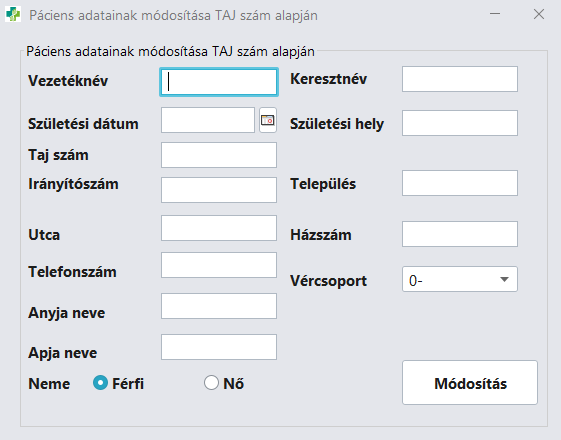
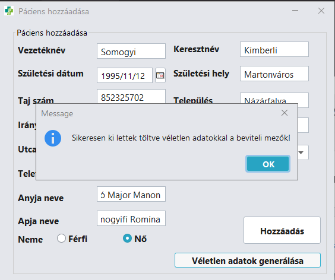

<p align="center">
    
</p>

# Egészségügyi nyilvántartó rendszer

> Páciensek tárolása és diagnózisok rögzítése egyszerűen.

## Tartalom

* [Általános leírás](#általános-leírás)
* [A program működése](#a-program-működése)
* [Objektumok felépítése](#objektumok-felépítése)
* [XML fájlstruktúrája](#xml-fájlstruktúra)
* [Használt maven dependenciák](#használt-maven-dependenciák)
* [Program használatának bemutatása](#program-használatának-bemutatása)
* [Használt képek és ikonok](#használt-képek-és-ikonok)

##  Általános leírás

Ez egy egészségügyi nyilvántartó program, amely segítségével XML fájlban tárolhatunk adatokat páciensekről és a hozzájuk tartozó diagnózisokat.
Az applikáció Java programozási nyelven készült és ablakos alkalmazás.
A Java-ban a [Swing API](https://en.wikipedia.org/wiki/Swing_(Java)) segítségével lehetséges ablakos alkalmazásokat létrehozni, amelyek Windows illetve Linux alapú rendszereken is futnak.

## A program működése

A program a legújabb Java JDK 17-es verziót használja és a Maven csomagkezelőt használja, amely kezeli a függőségeket (dependenciákat).

A Swing ablakok osztályai a `src/main/java/frames` mappában találhatóak és a program inditásakor a `Dashboard.java` JFrame ablak létrejön.


Itt található 6 gomb, amellyel különböző menüket nyithatunk meg.
Ezek rendszerint:
* Páciens hozzáadása `src/main/java/frames/AddPatient.java`
* Páciens törlése `src/main/java/frames/DeletePatient.java`
* Páciens adatmódosítása `src/main/java/frames/EditPatient.java`
* Betegség rögzítése `src/main/java/frames/AddDisease.java`
* Páciens list / export `src/main/java/frames/ListExport.java`
* Kórtörténet / adatok `src/main/java/frames/ViewMedicalHistory.java`

Az XML fájlok kezelését az `src/main/java/utils/XmlHandler.java` osztály végzi.

A bevitt adatok helyességét az `src/main/utils/ValidationUtils.java` osztály kezeli.

Továbbá az ablakokban szereplő szövegek az `src/main/utils/LanguageUtils.java` osztályból töltődnek be.

Az adatok exportálását végző metódus az `src/main/utils/ExportUtils.java` osztályban található.

Végül az objektumok megtalálhatóak az `src/main/objects` mappában.

### További screenshot-ok





## Objektumok felépítése

Az alábbi két táblázat bemutatja az objektumnak a felépítését és az itt felvázolt mezők rendelkeznek getter/setter függvényekkel.

**Fontos:** A páciensek személyes adatai közül az irányítószámot, az házszámot és a taj számot egy metódus ellenőrzi, hogy helyesek-e csak akkor lehet az új pácienst rögzíteni az adatbázisban.

**Formai követelmények:**
* Irányítószám - zipCode: 4 számjegyű kód
* Taj szám - tajNumber: 9 számjegyú kód
* Házszám - houseNumber: Csak számjegyekből állhat
* Születési dátum - bornDate: yyyy/MM/dd azaz év/hónap/nap formátumban kell megadni

### Páciens objektum (Patient.java)

| Páciens mező    | Leírás                |
|-----------------|-----------------------|
| **firstName**   | A páciens keresztneve |
| **lastName**    | A páciens vezetékneve |
| **bornDate**    | Születési dátum       |
| **zipCode**     | Páciens irányítószáma |
| **city**        | Páciens lakhelye      |
| **street**      | Utca                  |
| **houseNumber** | Házszám               |
| **motherName**  | Anyja neve            |
| **fatherName**  | Apja neve             |
| **bornPlace**   | Születési hely        |
| **phoneNumber** | Telefonszám           |
| **gender**      | Neme                  |
| **bloodGroup**  | Vércsoportja          |

### Diagnózis objektum (Diagnosis.java)

| Diagnózis mező    | Leírás                  |
|-------------------|-------------------------|
| **name**          | A diagnózis megnevezése |
| **expertOpinion** | Szakértői vélemény      |

### Vércsoport objektum (BloodGroup.java)

| Vércsoport jelölés | Megnevezés               |
|--------------------|--------------------------|
| **O_NEG**          | Nulla negatív vércsoport |
| **O_POS**          | Nulla pozitív vércsoport |
| **A_NEG**          | A negatív vércsoport     |
| **A_POS**          | A pozitív vércsoport     |
| **B_NEG**          | B negatív vércsoport     |
| **B_POS**          | B pozitív vércsoport     |
| **AB_NEG**         | AB negatív vércsoport    |
| **AB_POS**         | AB pozitív vércsoport    |

## XML fájlstruktúra

Az XML fájlok kezelésért az `xmlHandler.java` nevű osztály a felelős.

Az XML fájlban a `patient` tag tartalmazza a páciens adatait.

Az elsődleges kulcs a `tajNumber` attributúm, ami alapján lehet beazonosítani egy-egy személyt. Ez egy 9 számjegyű egyedi kód.

A páciens kórtörténetét a `medicalHistory` tag tartalmazza.

A diagnózisok ezen belűl találhatóak úgynevezett `diagnosis` tag-ek.

A diagnózisoknak az elsődleges kulcsa a `date` attributúm, formátuma `date="yyyy-MM-dd hh:mm"` ahol hh:mm órákat és perceket jelöl.

```xml
<patients>
    <patient tajNumber="xxxxxxxxx">
        <firstName>Keresztnév</firstName>
        <lastName>Vezetéknév</lastName>
        <bornDate>yyyy/MM/dd</bornDate>
        <zipCode>Irányítószám</zipCode>
        <city>Település</city>
        <street>Utca</street>
        <houseNumber>Házszám</houseNumber>
        <motherName>Anyja neve</motherName>
        <fatherName>Apja neve</fatherName>
        <bornPlace>Születési hely</bornPlace>
        <phoneNumber>Telefonszám</phoneNumber>
        <gender>Neme</gender>
        <bloodGroup>Vércsoportja</bloodGroup>
        <medicalHistory>
            <diagnosis date="yyyy-MM-dd hh:mm">
                <name>Diagnózis neve</name>
                <expertOpinion>Szakértői vélemény</expertOpinion>
            </diagnosis>
        </medicalHistory>
    </patient>
</patients>
```
## Program használatának bemutatása

### Új páciens rögzítése

A megfelelő beviteli mezők kitöltése után kattintsunk a **hozzáadás** gombra.
Ha bizonyos mezőbe nem megfelelő típusú adatok írtunk, akkor hibaüzenet jelenik meg.
Azonban, ha az adott taj számmal már létrehoztunk egy személyt az adatbázisban akkor megjelenik egy hibaüzenet.



Ha be akarjuk zárni az ablakot, akkor megjelenik egy megerősítő panel.


#### Példák a hibaüzenetekre


### Páciens törlése

Páciens eltávolítása esetén csak egy TAJ számot kell megadni, mert elsődleges kulcs szerepe van. Tehát egy személyhez csak 1 TAJ szám tartozik.

A beviteli mezőbe egy 9 számjegyű kódot kell megadni. Hiba esetén párbeszéd ablak jelenik meg.


#### Hibaüzenet ha ilyen személy nem létezik


### Páciens adatainak a módosítása

**Fontos: A páciens TAJ számát nem lehet módosítani, amennyiben rossz TAJ szám lett megadva, akkor a páciens törlésével és újboli hozzáadásával lehet orvosolni a problémát.**

Kattintsunk a páciens adatmódosítása gombra, majd megjelenik egy ablak, amely megegyezik a páciens létrehozásakor megjelenő ablakkal.
A hibakezelés is teljesen megegyezően zajlik.

*Azonban ha beírunk egy létező TAJ számot, akkor az összes mezőt kitölti automatikusan az adatbázisból, hogy ne kelljen újból beírni az adatokat*

A módosítandó adatokat átírjuk, majd a módosítás gombra kell kattintani.


### Diagnózis rögzítése

A diagnózis rögzítésekor meg kell adnunk a páciens TAJ számát, a betegség megnevezését és végül a rögzítés dátumát `év-hónap-nap óra:perc` formátumban.

Ha elkezdjük gépelni a TAJ számot és egy olyat adunk meg, ami létezik akkor ezt jelzi egy felugró panel.


Ha már létezik egy diagnózis egy adott dátumon akkor hibaüzenet jelenik meg.

A diagnózis törlése a jobb oldali panelben található, a TAJ szám megadásával és a keresés gombra való kattintás után megjelenik a táblázatban a kórtörténet.

A legördülő menüben ki kell választani azt a dátumot amely a törlendő diagnózishoz tartozik majd az **Eltávolítás** gombra kell kattintani.


### Kórtörténet megtekintése

Ha megadjuk a páciens TAJ számát és rákattintunk a **Keresés** gombra, akkor megjelenik az alatta lévő táblázatban a rögzített diagnózisok.
Az oldalt található szövegdoboz tartalma nem módosítható, csupán a páciens személyes adatait megjeleníti. Amennyiben nincs rögzített diagnózis és létezik a páciens akkor csak a személyes adatai jelennek meg oldalt és a kórtörténet táblázat pedig üres marad.


### Páciensek személyes adatainak exportálása


Amennyiben szeretnénk exportálni a páciensek adatait egy json állományban megtehetjük az **Exportálás json-be** nevezetű gomb megnyomásával.
Ha van az XML fájlba rögzítve páciens adat, akkor megjelenik egy információs ablak a *Páciens lista betöltve!* szöveggel.

Az exportált fájl megtalálható a program mappájában `PMI_C2_beadando/patients_export.json` néven.

## Használt maven dependenciák

A Swing komponensek között található JDatePicker nem bizonyult megfelelőnek.
LGoodDatePicker komponens segítségével lehet egyszerre dátumot és időt bekérni a felhasználótól.

A programban lehetséges megadni véletlenszerű adatokat, ezeket a [Faker](https://github.com/DiUS/java-faker) nevű könyvtárral lehetséges generálni.

Az exportálást a Google [Gson](https://github.com/google/gson) könyvtára végzi el.

A Swing UI alapértelmezett kinézetét felülírja a FlatLaf nevű könyvtár.

* **JCalendar**: https://mvnrepository.com/artifact/com.toedter/jcalendar
* **LGoodDatePicker**: https://mvnrepository.com/artifact/com.github.lgooddatepicker/LGoodDatePicker
* **Faker**: https://mvnrepository.com/artifact/com.github.javafaker/javafaker
* **Gson**: https://mvnrepository.com/artifact/com.google.code.gson/gson
* **Flatlaf**: https://search.maven.org/artifact/com.formdev/flatlaf/2.1/jar
* **FlatLaf-Intellij-Themes**: https://mvnrepository.com/artifact/com.formdev/flatlaf-intellij-themes 
## Használt képek és ikonok

* **Google Fonts**: *https://fonts.google.com/icons*
* **Pexels**: *https://www.pexels.com/hu-hu/*